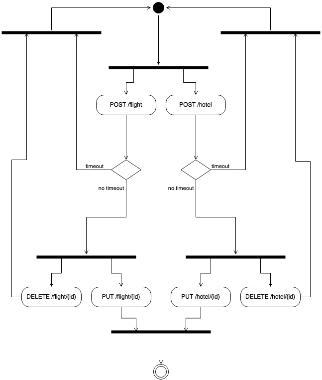

# Antworten zu Aufgabe 4

## 4a)

Zustandsdiagramm:



---

Wenn der Test-Client 11-mal ausgeführt wird, führt die Hotelreservierung zu einem HTTP 409 Conflict. Die Flugreservierung funktioniert wie gehabt:
```
Output from Server: FlightReservationDoc [name=Christian, url=http://localhost:4434/flight/01987027-9e02-4331-ad41-5da0006ad6f6, airline=airberlin, from=Karlsruhe, to=Berlin, expires=1687247693176, date=1687334032850, bookingDate=1687302000000, confirmed=false]
Failed : HTTP error code : 409
Output from Server: HotelReservationDoc [name=Christian, url=null, hotel=Interconti, expires=0, date=1687334032850, bookingDate=0, confirmed=false]
```

Das liegt daran, dass in `HotelReservationSystem.java:43` eine maximale Anzahl an Buchungen pro Tag auf 10 begrenzt wird.
Die maximale Anzahl der Flugresreservierungen pro Tag ist in `FlightReservationSystem.java:43` mit 20 doppelt so hoch angesetzt.

## 4b)


## 4c)